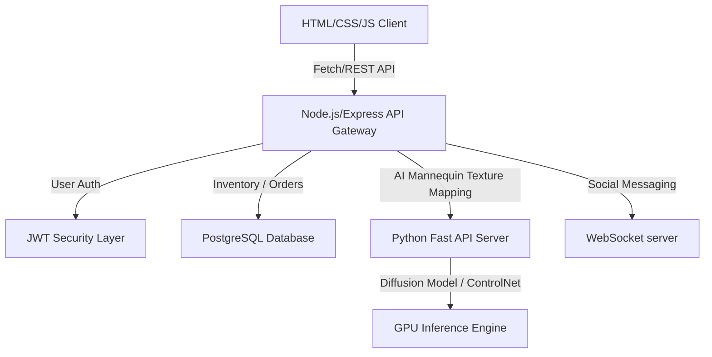

# AuraStitch AI - Premium AI Fashion & Handloom Platform

AuraStitch AI is a premium, luxury, and highly interactive B2B and B2C custom fashion design and handloom textile marketplace. The application connects fashion designers, boutique tailors, traditional heritage handloom weavers, craft suppliers, and clients onto a unified digital studio ecosystem.

## Project Overview

Built entirely using **HTML5, CSS3, and Vanilla JavaScript**, AuraStitch AI focuses on extreme performance, sleek animations, premium typography, and responsive, fluid glassmorphic UI layout systems. The platform implements dynamic themes (e.g., Traditional clay shades, Retro pastels, Royal velvet navy, organic Khadi/Linen overlays) matching active garment categories, and showcases a native Web Components system for reusable UI blocks (such as the navigation controls, collapsible menus, alerts overlays, and dynamic messenger chat boxes).

---

## Features

### 🌟 Core Capabilities
1.  **Unified Authentication Router**: Automatically parses entered account emails to route users to their respective dashboards (Customer, Tailor boutique studio, Handloom artisan workspace, Suppliers warehouses, or Admins panels) without requiring explicit role selection buttons.
2.  **Spotify-Style Preference Onboarding**: Guided setup screen for customers to save languages (English/Telugu/Hindi), styling categories (Wedding, Bridal, Retro), color swatches, and raw fabric preferences.
3.  **Avatar Mannequin Dress Lab**: Snapchat avatar builder inspired garment customization engine utilizing SVG overlays for swapping sleeve types, necklines, body bodice textures, borders, and accessories.
4.  **AI Handloom Studio**: Multi-stage weaver pattern wizard which lets weavers build temple borders, peacock/lotus motifs, and organic dye palettes to render custom fabric sheets.
5.  **Pinterest & Instagram Style Discover Feed**: Infinite scrolling Pinterest cards, story bubbles, and guest modal block guards.
6.  **Interactive B2B Inventory, Verification, & SaaS Management**: Detailed stock tracking dashboards, document verifications (Artisan ID and Trade License uploads), and Enterprise control monitors.

### 🌐 Unified Chat & Calling UI
-   **Conversation threads list** with search filters and active online indicators.
-   **Animated chat bubbles** supporting emoji pickers and mock document attachments.
-   **Calling screen overlays** supporting voice dialers and video screen loops with timers and mute indicators.

---

## Technologies Used

-   **Structure**: Semantic HTML5 markup.
-   **Styling**: Vanilla CSS3, custom HSL variable design tokens, backdrop-filters, custom scrollbars, and keyframe animations.
-   **Logic**: ES6+ Vanilla JavaScript. Custom Web Components are used for layout modularity.
-   **Fonts**: Playfair Display (Serif header typography) & Outfit (Geometric sans-serif UI typography) imported from Google Fonts.

---

## Folder Structure

```
aurastitch-ai/
├── README.md                      # Platform documentation
├── index.html                     # Splash screen and guest landing page
├── login.html                     # Unified role-based sign in router
├── register.html                  # Multi-role wizard registration forms
├── onboarding.html                # Customer onboarding setup wizard
├── pending-verification.html      # Business accounts verification pending screen
├── assets/
│   ├── css/
│   │   ├── variables.css          # Color HSL configurations, variables
│   │   ├── theme.css              # Main resetting, typography
│   │   ├── animations.css         # Keyframes (pulse, skeleton loaders)
│   │   └── common.css             # Main grids, structures, overlay styles
│   └── js/
│       ├── theme.js               # Dynamic localStorage dark/light swapper
│       ├── language.js            # Translation dictionary framework
│       └── common.js              # Toasts triggers, confirmation modals
├── components/
│   ├── navbar.js                  # <app-navbar> top navigation component
│   ├── sidebar.js                 # <app-sidebar> side links selector
│   ├── bottom-nav.js              # <app-bottom-nav> mobile actions tray
│   ├── chat-system.js             # <app-chat-system> messaging drawer
│   └── call-overlay.js            # <app-call-overlay> voice/video calling popups
├── customer/
│   ├── dashboard.html             # Customer discover feed & style filters
│   └── design-lab.html            # Garment customization laboratory
├── tailor/
│   └── dashboard.html             # Stitching orders and portfolio workspace
├── handloom/
│   ├── dashboard.html             # Artisan loom progress workspace
│   └── ai-handloom-studio.html    # Border and motif custom pattern designer
├── supplier/
│   └── dashboard.html             # Fabric reels warehouse supply tracker
├── admin/
│   └── dashboard.html             # SaaS approvals and platform health center
└── ai/
    └── dashboard.html             # Smart styling recommender dashboard
```

---

## How to Run

1.  Clone or download the project root directory folder `aurastitch-ai`.
2.  Open `index.html` inside any modern web browser to view the guest landing page and watch the luxury splash screen animation load.
3.  To sign in to specific dashboards, navigate to `login.html` and key in mock emails matching the role categories:
    *   **Customer Dashboard**: Enter `customer@aurastitch.ai` (initiates Onboarding wizard on first visit).
    *   **Tailor Studio Dashboard**: Enter `tailor@aurastitch.ai`.
    *   **Handloom Weaver Dashboard**: Enter `weaver@aurastitch.ai`.
    *   **Textile Supplier Dashboard**: Enter `supplier@aurastitch.ai`.
    *   **Enterprise Admin Dashboard**: Enter `admin@aurastitch.ai`.
4.  Switch custom styling configurations by clicking the category filter tabs (Traditional clay, Retro vintage, Royal navy gold, Handloom weave sage green) on the customer dashboard.

---

## Future Backend Integration Plan



### Proposed Database Entities
-   **Users**: Unified credentials, role types, business profiles, and verification flags.
-   **Garment Designs**: Multi-layer configuration structures (neck style, sleeves, base fabric textures maps) saved in JSON format.
-   **Loom Concepts**: Pattern layouts (borders, motifs, base colors) matching handloom weaves.
-   **Orders**: Transaction IDs, production stages (Cutting $\rightarrow$ Stitching $\rightarrow$ Packaging), custom sizing profiles, and review ratings.

---

## License

Standard startup proprietary code layout. Demo portfolio templates.
